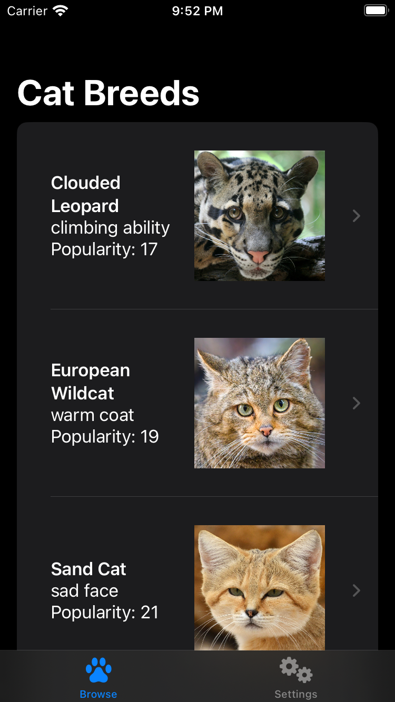
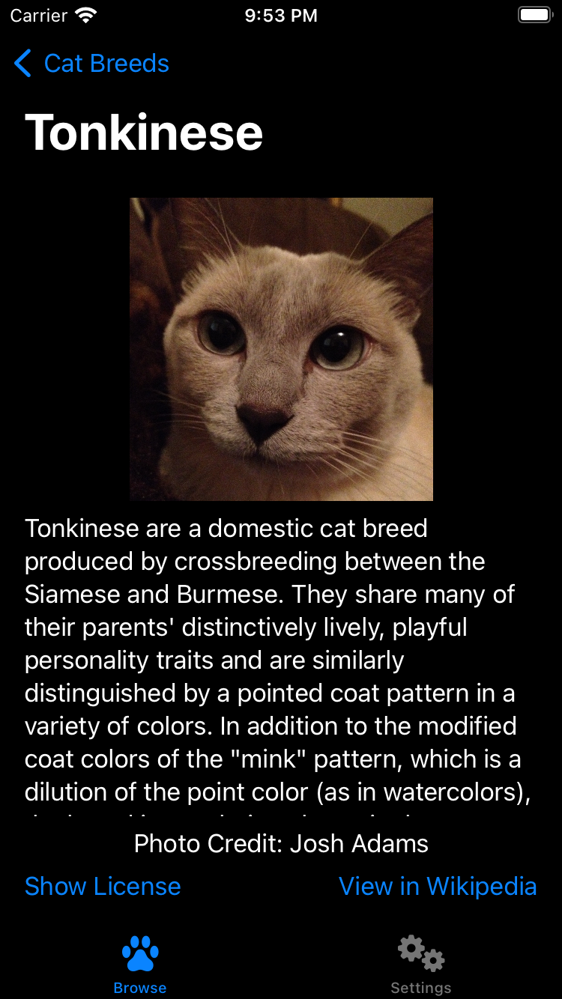
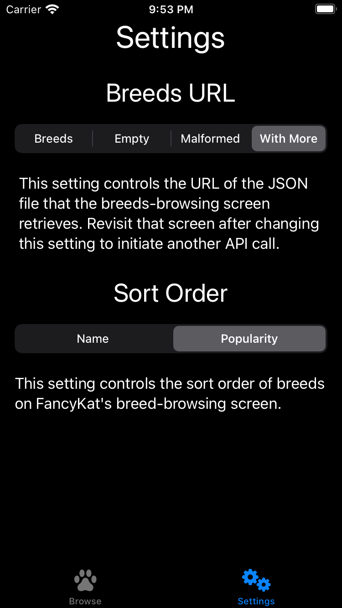
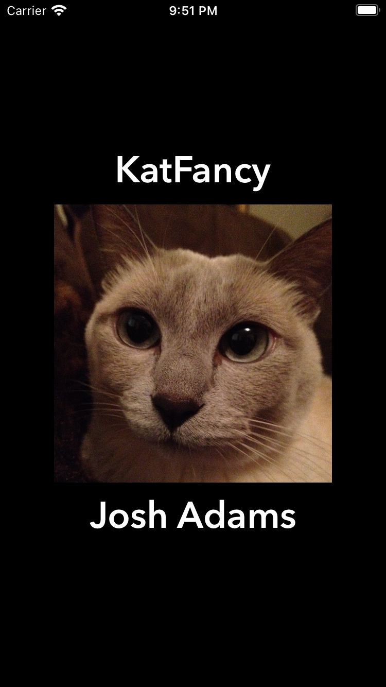

KatFancy
===========

 

## Introduction

KatFancy is an iOS app that demonstrates iOS-development techniques, including use of SwiftUI. Users can browse breeds of cats with images from various sources and breed info from Wikipedia.

## Build Tools & Versions Used

I developed KatFancy using Xcode 14.1, iOS 16.1, SwiftLint 0.30.1, and [this song](https://youtu.be/gHFb1WFG5PU?t=3630).

## Screenshots

| Browsing | Details |
| -------- | ------- |
|  |  |

| Settings | Splash |
| -------- | ------- |
|  |  |

## Credits

Christy Presler created the app icon and released it under the [CC BY-SA 3.0 license](https://creativecommons.org/licenses/by-sa/3.0/).

[Sound Jay](https://www.soundjay.com) created the chime and sad-trombone sounds and "[allow](https://www.soundjay.com/tos.html)[s] ... incorporat[ion of these sounds] into ... projects, be it for commercial or non-commercial use." Sound Jay "and its licensors retain all ownership rights to the sound files".

The humorous badges at the top of this readme are from my [curated list](https://github.com/vermont42/Podcasts) of iOS-development podcasts.

`Settings.swift` and the `GetterSetter` files reflect an approach to storing and retrieving settings that I developed for [Immigration](https://itunes.apple.com/us/app/immigration/id777319358) and also use in [Racerunner](https://itunes.apple.com/us/app/racerunner-run-tracking-app/id1065017082) ([GitHub](https://github.com/vermont42/RaceRunner)), [Conjugar](https://itunes.apple.com/us/app/conjugar/id1236500467) ([GitHub](https://github.com/vermont42/Conjugar/)), and [Conjuguer](https://apps.apple.com/us/app/conjuguer/id1588624373) ([GitHub](https://github.com/vermont42/Conjuguer)).

`SoundPlayerReal.swift` reflects an approach to playing sounds that I developed for Immigration and also use in RaceRunner, Conjugar, and Conjuguer, though I added dependency injection to KatFancy's implementation because playing a sound is a side effect, I realized, that is undesirable in unit tests.

`UIViewControllerExtensionTests.swift` contains [code](https://github.com/vermont42/Conjugar/blob/master/ConjugarTests/Utils/UIViewControllerExtensionsTests.swift) I developed for Conjugar.

[Point-Free](https://www.pointfree.co/) developed and [evangelized](https://www.pointfree.co/blog/posts/21-how-to-control-the-world) KatFancy's approach to dependency injection, The World.

Paul Hudson [shared](https://www.hackingwithswift.com/articles/153/how-to-test-ios-networking-code-the-easy-way) the approach to dependency injection for `URLSession` used in `URLProtocolStub.swift` and `URLSessionExtension.swift`.
