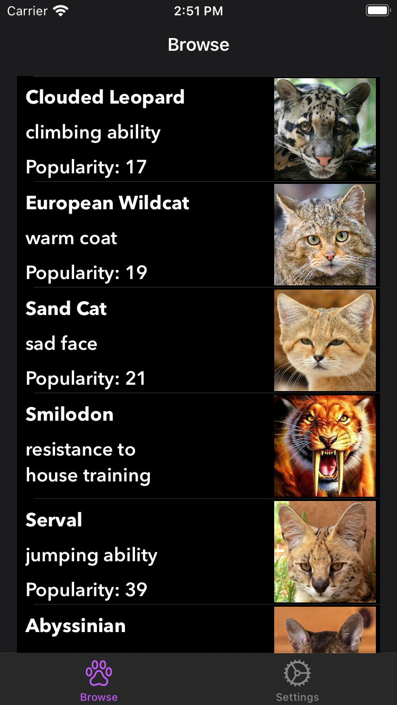
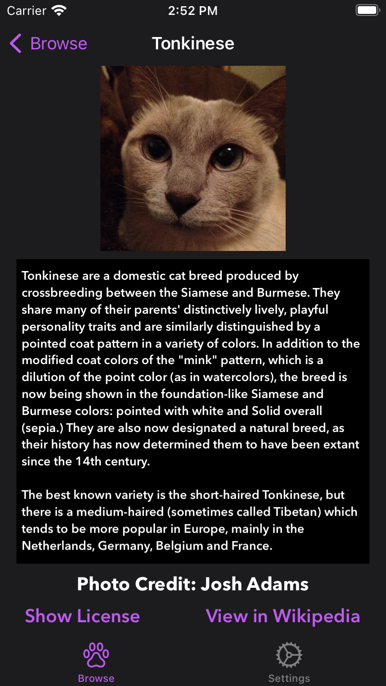
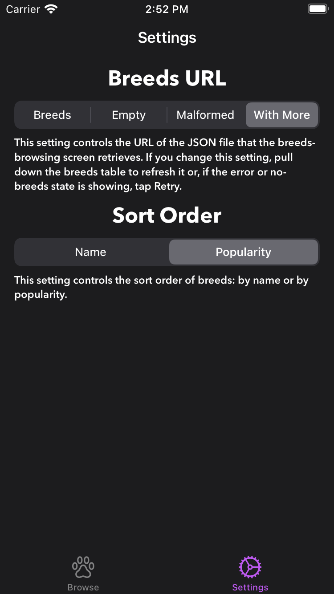
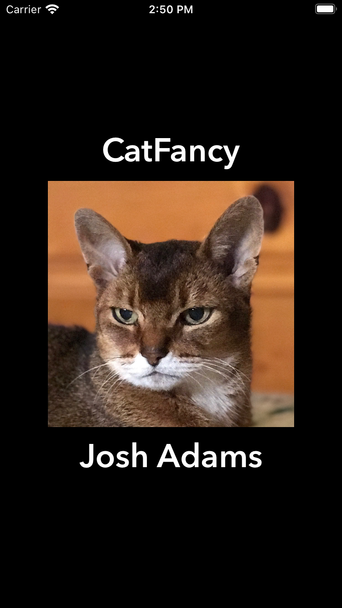

CatFancy
===========

 

## Introduction

CatFancy is an iOS app that demonstrates iOS-development techniques by solving a coding challenge using UIKit. Users can browse breeds of cats with images from various sources and breed info from Wikipedia.

## Build Tools & Versions Used

I developed CatFancy using Xcode 15, iOS 17, SwiftLint 0.52.3, and [this song](https://www.youtube.com/watch?v=e4ItJXUKk50).

## Discussion

Aside from meeting the requirements of the coding challenge, I focused in CatFancy on using a technique, dependency injection, and an architectural pattern, the coordinator, that facilitate unit testing. I have come to value unit testing because, as Jon Reid [observed](https://qualitycoding.org), a "robust suite of unit tests acts as a safety harness, giving you [courage](https://www.theverge.com/2016/9/7/12838024/apple-iphone-7-plus-headphone-jack-removal-courage) to make bold changes." In nuts-and-bolts terms, dependency injection makes objects testable by isolating dependencies and side effects. I have [written](https://racecondition.software/blog/dependency-injection/) [elsewhere](https://racecondition.software/blog/unit-testing/) on dependency injection. The coordinator pattern makes `UIViewController`s more testable by removing from them the work of navigating to other `UIViewController`s, whether in the [app itself](CatFancy/Navigation/BrowseBreedsDelegate.swift) or in [external apps](CatFancy/Navigation/BreedDelegate.swift). CatFancy's unit-test coverage is 88.7%.

CatFancy demonstrates two newer Swift features, `if let` [shorthand](https://github.com/apple/swift-evolution/blob/main/proposals/0345-if-let-shorthand.md) and `async`/`await` [concurrency](https://github.com/apple/swift-evolution/blob/main/proposals/0296-async-await.md).

Although the requirements only call for two screens, breed browsing and breed details, I chose to implement a settings screen to give the reviewer the option of choosing an alternate `URL` or `URLSession`. This screen is also home to the sort-order setting.

CatFancy supports iPhone, iPad, landscape orientation, portrait orientation, Light Mode, and Dark Mode. I developed CatFancy primarily for iPhone. iPad would benefit from, for example, higher information density in breed rows. Landscape orientation on iPhone would be more idiomatic if it used `UISplitViewController` like [Mail](https://apps.apple.com/us/app/mail/id1108187098) does. Due to time constraints that are characteristic of coding challenges, CatFancy may imperfectly support VoiceOver, but accessibility [is important](https://github.com/vermont42/Conjuguer/commit/7d93d1459a085bb498cf9a7e4f3680f2d7e08839) to me.

In both [profes](https://apps.apple.com/us/app/capital-one-mobile/id407558537)[sional](https://itunes.apple.com/us/app/sfo-taxiq/id1096206222) and [side](https://github.com/vermont42/RaceRunner/blob/master/RaceRunner/UiConstants.swift)-[project](https://github.com/vermont42/Conjugar/blob/master/Conjugar/Colors.swift) apps, I use color palettes from designers or the website [Coolors](https://coolors.co). In CatFancy, I relied on system-provided colors due to time constraints.

The breeds fit perfectly the dainty iPhone SE form factor. If some breed info ended up not fitting in a `BreedCell`, tweaks would be in order. `MarqueeLabel`, a `UILabel` [replacement](https://github.com/cbpowell/MarqueeLabel) that has performed [well](https://github.com/vermont42/RaceRunner/blob/master/RaceRunner/RunDetailsVC.swift#L29) in RaceRunner, would obviate the need for either `String` truncation or widespread UI changes. Dynamic Type, which I did not test due to time constraints, might also necessitate tweaks.

The coding challenge has no requirement for internationalization or localization so, in the interest of time, I did not wrap user-facing `String`s in `NSLocalizedString()`. I am, however, comfortable with that API.

## Warning

If you run CatFancy in the simulator, as I did during development, you may see the following warning:

`[plugin] AddInstanceForFactory: No factory registered for id <CFUUID 0x6000001ad4a0> F8BB1C28-BAE8-11D6-9C31-00039315CD46`

My research indicates that this warning is [harmless](https://en.wikipedia.org/wiki/Mostly_Harmless). I expect Apple to fix it in a future version of Xcode and iOS.

## Screenshots

| Browsing | Details |
| -------- | ------- |
|  |  |

| Settings | Launch |
| -------- | ------- |
|  |  |

## Credits

Christy Presler created the app icon and released it under the [CC BY-SA 3.0 license](https://creativecommons.org/licenses/by-sa/3.0/).

[Sound Jay](https://www.soundjay.com) created the chime and sad-trombone sounds and "[allow](https://www.soundjay.com/tos.html)[s] ... incorporat[ion of these sounds] into ... projects, be it for commercial or non-commercial use." Sound Jay "and its licensors retain all ownership rights to the sound files".

The humorous badges at the top of this readme are from my [curated list](https://github.com/vermont42/Podcasts) of iOS-development podcasts.

`Settings.swift` and the `GetterSetter` files reflect an approach to storing and retrieving settings that I developed for [Immigration](https://itunes.apple.com/us/app/immigration/id777319358) and also use in [Racerunner](https://itunes.apple.com/us/app/racerunner-run-tracking-app/id1065017082) ([GitHub](https://github.com/vermont42/RaceRunner)), [Conjugar](https://itunes.apple.com/us/app/conjugar/id1236500467) ([GitHub](https://github.com/vermont42/Conjugar/)), and [Conjuguer](https://apps.apple.com/us/app/conjuguer/id1588624373) ([GitHub](https://github.com/vermont42/Conjuguer)).

`SoundPlayerReal.swift` reflects an approach to playing sounds that I developed for Immigration and also use in RaceRunner, Conjugar, and Conjuguer, though I added dependency injection to CatFancy's implementation because playing a sound is a side effect, I realized, that is undesirable in unit tests.

`UIViewControllerExtensionTests.swift` contains [code](https://github.com/vermont42/Conjugar/blob/master/ConjugarTests/Utils/UIViewControllerExtensionsTests.swift) I developed for Conjugar.

Doug Suriano [shared](https://youtu.be/DmpoiN-SVds) the boilerplate-reduction technique in `NSLayoutConstraintExtension.swift`.

Antoine van der Lee [shared](https://www.avanderlee.com/swift/auto-layout-programmatically/) the boilerplate-reduction technique in `UsesAutoLayout.swift`.

[Point-Free](https://www.pointfree.co/) developed and [evangelized](https://www.pointfree.co/blog/posts/21-how-to-control-the-world) CatFancy's approach to dependency injection, The World.

Paul Hudson [shared](https://www.hackingwithswift.com/articles/153/how-to-test-ios-networking-code-the-easy-way) the approach to dependency injection for `URLSession` used in `URLProtocolStub.swift` and `URLSessionExtension.swift`. His article preceded `async`/`await`, and I modified the implementation to support it.

Soroush Khanlou [developed](http://khanlou.com/2015/01/the-coordinator/) the coordinator pattern that CatFancy uses for navigation. [Two](https://www.hackingwithswift.com/articles/71/how-to-use-the-coordinator-pattern-in-ios-apps) [posts](https://www.hackingwithswift.com/articles/175/advanced-coordinator-pattern-tutorial-ios) by Paul Hudson also informed CatFancy's implementation.

Geoff Hackworth [shared](https://medium.com/@hacknicity/how-to-switch-your-ios-app-and-scene-delegates-for-improved-testing-9746279378c3) the technique of bespoke app/scene delegates for unit tests exemplified by `TestingRootViewController.swift`, `TestingAppDelegate.swift`,  `TestingSceneDelegate.swift`, and `main.swift`, building on a technique [shared](https://qualitycoding.org/ios-app-delegate-testing/) by Jon Reid.

An earlier version of CatFancy accompanied [this blog post](https://racecondition.software/blog/challenges/) about UIKit iOS-developer coding challenges.
