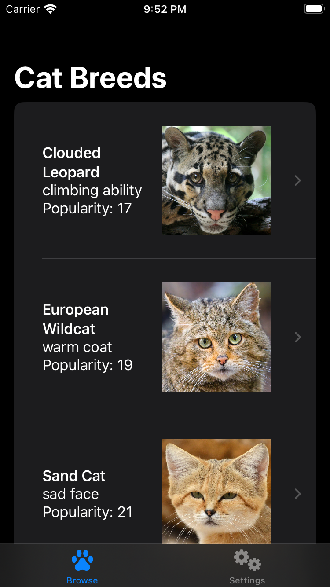

KatFancy
===========

 

## Introduction

KatFancy is an iOS app that demonstrates iOS-development techniques by solving a coding challenge using SwiftUI. Users can browse breeds of cats with images from various sources and breed info from Wikipedia.

## Build Tools & Versions Used

I developed KatFancy using Xcode 15.0, iOS 17.0, SwiftLint 0.52.3, and [this song](https://youtu.be/gHFb1WFG5PU?t=3630).

## Discussion

Aside from meeting the requirements of the coding challenge, I focused in KatFancy on using a technique, dependency injection, that facilitates unit testing. I have come to value unit testing because, as Jon Reid [observed](https://qualitycoding.org), a "robust suite of unit tests acts as a safety harness, giving you [courage](https://www.theverge.com/2016/9/7/12838024/apple-iphone-7-plus-headphone-jack-removal-courage) to make bold changes." In nuts-and-bolts terms, dependency injection makes objects testable by isolating dependencies and side effects. I have [written](https://racecondition.software/blog/dependency-injection/) [elsewhere](https://racecondition.software/blog/unit-testing/) on dependency injection.

KatFancy uses a view model to mediate between `BrowseBreedsView` and its model, an array of `Breed`s, as well as to maintain loading state. This view model keeps the view simple and is highly unit-testable.

KatFancy demonstrates two newer Swift features, `if let` [shorthand](https://github.com/apple/swift-evolution/blob/main/proposals/0345-if-let-shorthand.md) and `async`/`await` [concurrency](https://github.com/apple/swift-evolution/blob/main/proposals/0296-async-await.md). KatFancy also demonstrates two new SwiftUI features, `@Observable` and `#Preview`.

Although the requirements only call for two screens, breed browsing and breed details, I chose to implement a settings screen to give the reviewer the option of choosing an alternate `URL` or `URLSession`. This screen is also home to the sort-order setting.

KatFancy supports iPhone, iPad, landscape orientation, portrait orientation, Light Mode, and Dark Mode. I developed KatFancy primarily for iPhone. iPad would benefit from, for example, higher information density in breed rows. Due to time constraints that are characteristic of coding challenges, CatFancy may imperfectly support VoiceOver, but accessibility [is important](https://github.com/vermont42/Conjuguer/commit/7d93d1459a085bb498cf9a7e4f3680f2d7e08839) to me.

In both [profes](https://apps.apple.com/us/app/capital-one-mobile/id407558537)[sional](https://itunes.apple.com/us/app/sfo-taxiq/id1096206222) and [side](https://github.com/vermont42/RaceRunner/blob/master/RaceRunner/UiConstants.swift)-[project](https://github.com/vermont42/Conjugar/blob/master/Conjugar/Colors.swift) apps, I use color palettes from designers or the website [Coolors](https://coolors.co). In KatFancy, I relied on system-provided colors due to time constraints.

The breeds fit perfectly the dainty iPhone SE form factor. If some breed info ended up not fitting properly, tweaks would be in order.

The coding challenge has no requirement for internationalization or localization so, in the interest of time, I did not wrap user-facing `String`s in `NSLocalizedString()`. I am, however, comfortable with that API.

## Warnings

If you run KatFancy in the simulator, as I did during development, you may see the following warnings:

`AddInstanceForFactory: No factory registered for id <CFUUID 0x600000299d60> F8BB1C28-BAE8-11D6-9C31-00039315CD46`

`81,923 HALC_ProxyIOContext.cpp:1,314 HALC_ProxyIOContext::IOWorkLoop: skipping cycle due to overload`

My research [indicates](https://forum.juce.com/t/addinstanceforfactory-no-factory-registered-for-id/55166/2) that the first warning is [harmless](https://en.wikipedia.org/wiki/Mostly_Harmless). I was unable to detemine the cause of or solution for the second warning, but it also appears harmless.

## Screenshots

| Browsing | Details |
| -------- | ------- |
|  |  |

| Settings | Launch |
| -------- | ------- |
|  |  |

## Credits

Christy Presler created the app icon and released it under the [CC BY-SA 3.0 license](https://creativecommons.org/licenses/by-sa/3.0/).

[Sound Jay](https://www.soundjay.com) created the chime and sad-trombone sounds and "[allow](https://www.soundjay.com/tos.html)[s] ... incorporat[ion of these sounds] into ... projects, be it for commercial or non-commercial use." Sound Jay "and its licensors retain all ownership rights to the sound files".

The humorous badges at the top of this readme are from my [curated list](https://github.com/vermont42/Podcasts) of iOS-development podcasts.

`Settings.swift` and the `GetterSetter` files reflect an approach to storing and retrieving settings that I developed for [Immigration](https://itunes.apple.com/us/app/immigration/id777319358) and also use in [Racerunner](https://itunes.apple.com/us/app/racerunner-run-tracking-app/id1065017082) ([GitHub](https://github.com/vermont42/RaceRunner)), [Conjugar](https://itunes.apple.com/us/app/conjugar/id1236500467) ([GitHub](https://github.com/vermont42/Conjugar/)), and [Conjuguer](https://apps.apple.com/us/app/conjuguer/id1588624373) ([GitHub](https://github.com/vermont42/Conjuguer)).

`SoundPlayerReal.swift` reflects an approach to playing sounds that I developed for Immigration and also use in RaceRunner, Conjugar, and Conjuguer, though I added dependency injection to KatFancy's implementation because playing a sound is a side effect, I realized, that is undesirable in unit tests.

`UIViewControllerExtensionTests.swift` contains [code](https://github.com/vermont42/Conjugar/blob/master/ConjugarTests/Utils/UIViewControllerExtensionsTests.swift) I developed for Conjugar.

[Point-Free](https://www.pointfree.co/) developed and [evangelized](https://www.pointfree.co/blog/posts/21-how-to-control-the-world) KatFancy's approach to dependency injection, The World.

Paul Hudson [shared](https://www.hackingwithswift.com/articles/153/how-to-test-ios-networking-code-the-easy-way) the approach to dependency injection for `URLSession` used in `URLProtocolStub.swift` and `URLSessionExtension.swift`. His article preceded `async`/`await`, and I modified the implementation to support it.

`ImageLoader` is a modification of an approach to image caching that Donny Wals presented in [this article](https://www.donnywals.com/using-swifts-async-await-to-build-an-image-loader/).

[This video](https://www.youtube.com/watch?v=n1PeOa3qXy8) by Vincent Pradeilles inspired KatFancy's implementation.

Breed descriptions are from Wikipedia articles licensed under the [Creative Commons Attribution-Share-Alike License 3.0](https://creativecommons.org/licenses/by-sa/3.0/). Changes to the descriptions involve removal of footnotes and fixing of non-printing characters.

An earlier version of KatFancy accompanied [this blog post](https://racecondition.software/blog/swiftui-homeworks/) about SwiftUI iOS-developer coding challenges.
